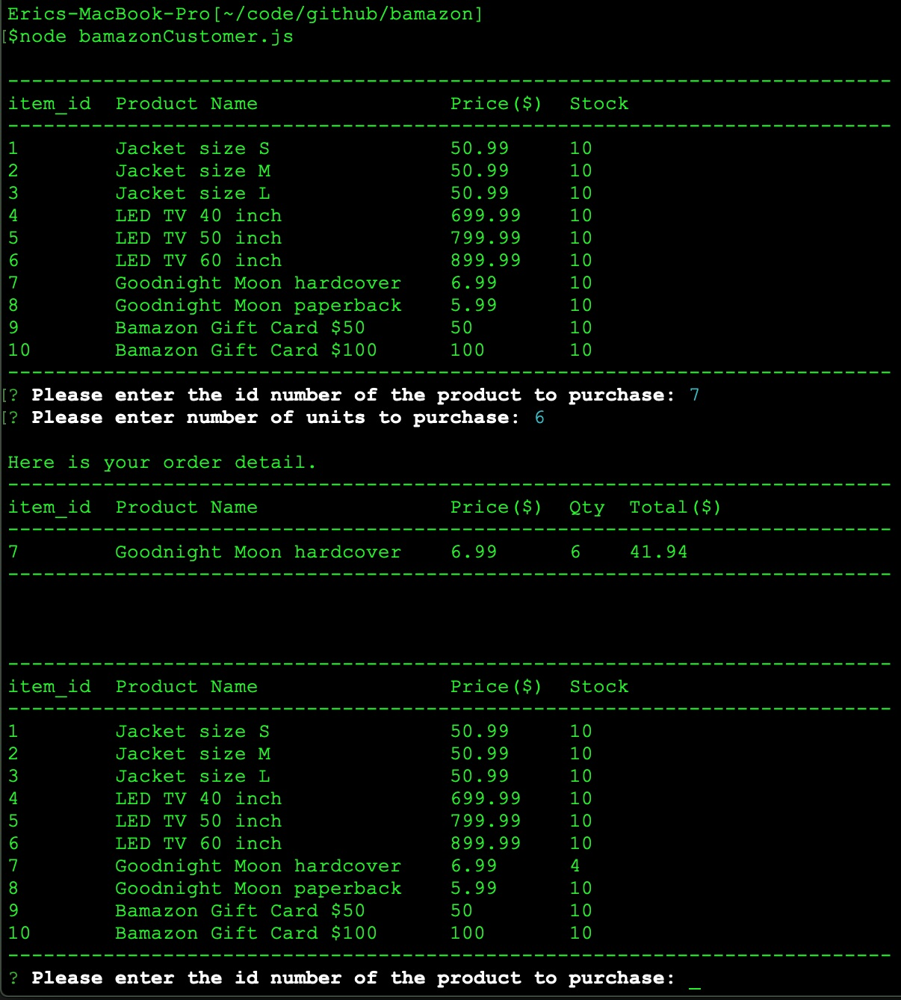
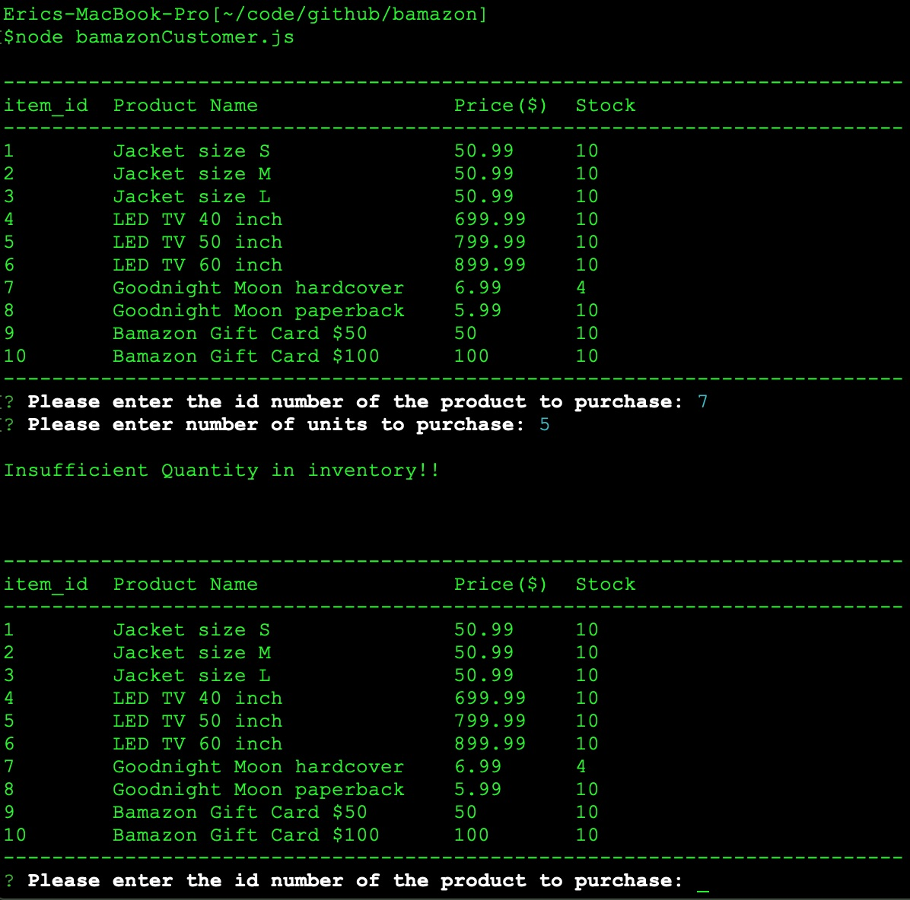

# bamazon
bamazonCustomer.js is an Amazon-like storefront Nodejs app using MySQL. 

## Files
- bamazonCustomer.js - main javascript file
- bamazon.sql - setting up database with initial values in MySQL server.
## npm package used
- inquirer
- mysql

## Execting app in command line
- node bamazonCustomer.js
- order available only within the range of item_id.
- ordering with exceded quantity will restart the app.

## Challenge #1
The app will first shows items table and take an order. Upon availabiliy, order detail including total item id, product name, quantity, and total price is displayed. Then the updated database is displayed. App will keep taking another new order from customer.

## Screenshots when the app running in command line

Figure 1. Running bamazonCustomer.js in commandline for challenge #1. Displays inventory, takes an order, display order detail including calculated total amount, display updated inventory and takes a new order.

Figure 2. Inquirer input does not accepts an out of ranged item_id or 0 as an order quantity. When ordered quantity exceeds inventory then displays "Insufficient Quantity in inventory!!", and shows items table, and restarts order process.

## Progres so far
- MySQL Database called "bamazon" created.
- A Table called "products" created with columns of 
  - item_id (unique id for each product)
  - product_name (Name of product)
  - department_name
  - price (cost to customer)
  - stock_quantity (how much of the product is available in stores)
- 10 different products populated in the database.
- Order function tested.
- Validation in inquirer successfully operates.

## Remark
Currently completed challenge #1. Will be updated other parts of the assignment. The password for the mysql connection is coded with "" in the bamazonCustomer.js file.